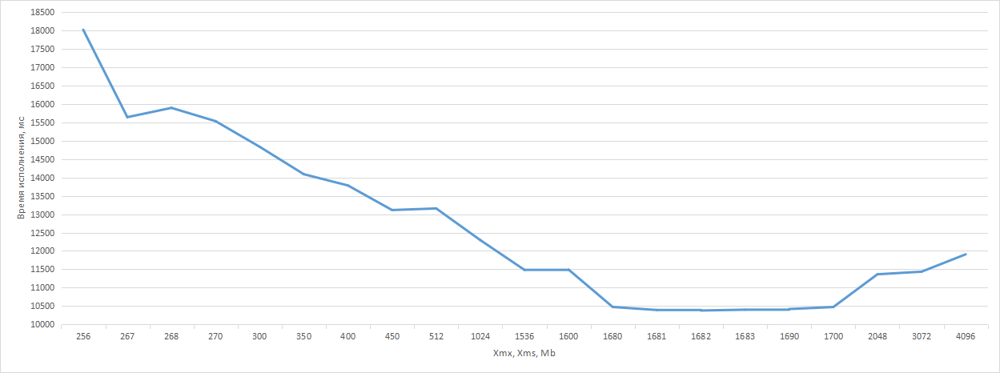
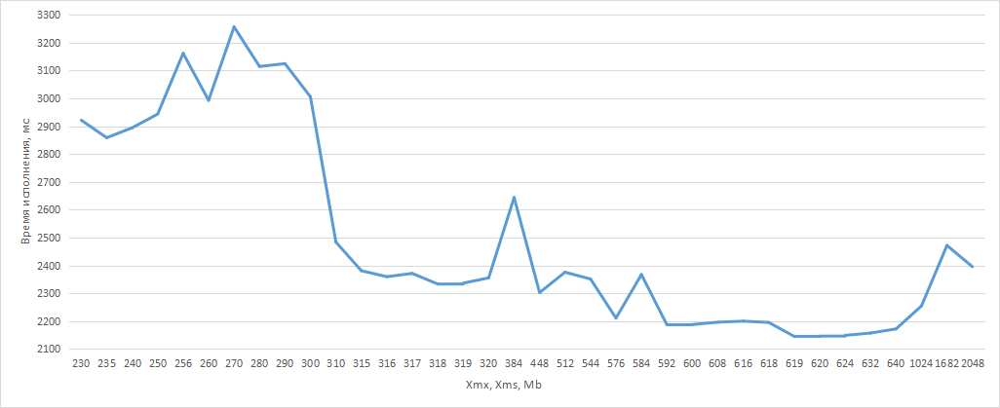

# Домашняя работа №4

## Определение нужного размера хипа

**Цель:** на примере простого приложения понять какое влияние оказывают сборщики мусора.

**Описание/Пошаговая инструкция выполнения домашнего задания:**

1. Есть готовое приложение `CalcDemo`. Запустите его с размером хипа 256 Мб и посмотрите в логе время выполнения.
   Увеличьте размер хипа до 2 Гб, замерьте время выполнения. Результаты запусков записывайте в таблицу. Определите
   оптимальный размер хипа, т.е. размер, превышение которого, не приводит к сокращению времени выполнения приложения.
2. Оптимизируйте работу приложения. Т.е. не меняя логики работы (но изменяя код), сделайте так, чтобы приложение
   работало быстро с минимальным хипом. Повторите измерения времени выполнения программы для тех же значений размера
   хипа.

## Результаты

Запуски производились следующим скриптом:

```bash
 #!/bin/sh
 heap=$1
 echo $heap
 java -XX:+UseG1GC -Xms$heap -Xmx$heap -jar hw04-gc-1.0.0.jar
```

Во время этих запусков использовалась одна и та же jar в одинаковых условиях.

### Часть первая

Результаты запусков представлены в таблицах.

| Время, мс \ Xmx, Xms Mb |       256 |       267 |       268 |       270 |       300 |       350 |       400 |       450 |       512 |     1 024 |
|:-----------------------:|----------:|----------:|----------:|----------:|----------:|----------:|----------:|----------:|----------:|----------:|
|            1            |    18 020 |    15 664 |    15 823 |    15 460 |    15 094 |    14 026 |    13 742 |    13 056 |    13 007 |    12 079 |
|            2            |           |    15 647 |    15 940 |    15 450 |    14 704 |    14 159 |    13 784 |    13 121 |    13 184 |    12 069 |
|            3            |           |    15 612 |    15 849 |    15 607 |    14 703 |    14 078 |    13 819 |    13 160 |    13 118 |    12 149 |
|            4            |           |           |    16 055 |    15 469 |           |           |           |           |    13 091 |    13 890 |
|            5            |           |           |    15 851 |    15 528 |           |           |           |           |    13 068 |    11 978 |
|            6            |           |           |    16 122 |    15 688 |           |           |           |           |    13 146 |    12 059 |
|            7            |           |           |    15 836 |    15 435 |           |           |           |           |    13 279 |    12 060 |
|            8            |           |           |    15 800 |    15 535 |           |           |           |           |    13 355 |    12 066 |
|            9            |           |           |    15 805 |    15 610 |           |           |           |           |           |           |
|           10            |           |           |    15 859 |    15 538 |           |           |           |           |           |           |
|                         |           |           |           |           |           |           |           |           |           |           |
|    Среднее время, мс    | 18 020,00 | 15 641,00 | 15 894,00 | 15 532,00 | 14 833,67 | 14 087,67 | 13 781,67 | 13 112,33 | 13 156,00 | 12 293,75 |
|       Примечание        |  OOMError |  OOMError |  OOMError |           |           |           |           |           |           |           |

| Время, мс \ Xmx, Xms Mb |     1 536 |     1 680 |     1 681 |     **1 682** |     1 683 |     1 690 |     1 700 |     2 048 |     3 072 |     4 096 |
|:-----------------------:|----------:|----------:|----------:|--------------:|----------:|----------:|----------:|----------:|----------:|----------:|
|            1            |    11 498 |    10 547 |    10 364 |    **10 376** |    10 390 |    10 417 |    10 464 |    11 348 |    11 359 |    11 918 |
|            2            |    11 513 |    10 382 |    10 400 |    **10 371** |    10 389 |    10 418 |    10 479 |    11 346 |    11 579 |    11 984 |
|            3            |    11 481 |    10 547 |    10 386 |    **10 391** |    10 407 |    10 423 |    10 486 |    11 361 |    11 411 |    11 568 |
|            4            |    11 461 |    10 516 |    10 393 |    **10 370** |    10 390 |    10 413 |    10 464 |    11 377 |    11 373 |    11 544 |
|            5            |    11 410 |    10 378 |    10 414 |    **10 385** |    10 424 |    10 420 |    10 468 |    11 363 |    11 591 |    12 448 |
|            6            |    11 540 |           |           |    **10 370** |           |           |           |    11 374 |    11 360 |    11 983 |
|            7            |           |           |           |               |           |           |           |    11 379 |    11 370 |           |
|                         |           |           |           |               |           |           |           |           |           |           |
|    Среднее время, мс    | 11 483,83 | 10 474,00 | 10 391,40 | **10 377,17** | 10 400,00 | 10 418,20 | 10 472,20 | 11 364,00 | 11 434,71 | 11 907,50 |



Можно сделать вывод, что оптимальный размер хипа для исходного кода, прилагаемого к заданию, является 1682 Мб (среднее
время работы приложения 10,37 секунды), т.к. дальнейшее увеличение доступной памяти не дает прироста в скорости
выполнения приложения.

### Часть вторая

| Время, мс \ Xmx, Xms Mb |   230    |   235    |   240    |   250    |   256    |   260    |   270    |   280    |   290    |   300    |   310    |   315    |
|:-----------------------:|:--------:|:--------:|:--------:|:--------:|:--------:|:--------:|:--------:|:--------:|:--------:|:--------:|:--------:|:--------:|
|            1            |  2 803   |  2 865   |  2 896   |  2 881   |  2 921   |  2 998   |  3 288   |  3 083   |  3 094   |  2 983   |  2 397   |  2 373   |
|            2            |  2 989   |  2 872   |  2 888   |  2 905   |  3 020   |  2 988   |  3 225   |  3 146   |  3 155   |  3 028   |  2 301   |  2 381   |
|            3            |  3 014   |  2 834   |  2 868   |  2 872   |  3 294   |          |          |          |          |          |  2 357   |  2 389   |
|            4            |  2 857   |  2 889   |  2 876   |  2 889   |  3 115   |          |          |          |          |          |  2 289   |          |
|            5            |  3 014   |  2 858   |  2 920   |  2 927   |  3 160   |          |          |          |          |          |  2 287   |          |
|            6            |  3 014   |  2 834   |  2 872   |  2 897   |  3 334   |          |          |          |          |          |  2 616   |          |
|            7            |  2 842   |  2 860   |  2 927   |  3 162   |  3 224   |          |          |          |          |          |  2 632   |          |
|            8            |  3 029   |  2 873   |  2 888   |  2 895   |  3 099   |          |          |          |          |          |  2 749   |          |
|            9            |  2 835   |  2 850   |  2 911   |  2 921   |  3 218   |          |          |          |          |          |  2 601   |          |
|           10            |  2 817   |  2 851   |  2 897   |  3 085   |  3 231   |          |          |          |          |          |  2 609   |          |
|                         |          |          |          |          |          |          |          |          |          |          |          |          |
|    Среднее время, мс    | 2 921,40 | 2 858,60 | 2 894,30 | 2 943,40 | 3 161,60 | 2 993,00 | 3 256,50 | 3 114,50 | 3 124,50 | 3 005,50 | 2 483,80 | 2 381,00 |

| Время, мс \ Xmx, Xms Mb |   316    |   317    |   318    |   319    |   320    |   384    |   448    |   512    |   544    |   576    |   584    |   592    |
|:-----------------------:|:--------:|:--------:|:--------:|:--------:|:--------:|:--------:|:--------:|:--------:|:--------:|:--------:|:--------:|:--------:|
|            1            |  2 373   |  2 333   |  2 326   |  2 384   |  2 320   |  2 640   |  2 301   |  2 311   |  2 295   |  2 312   |  2 317   |  2 194   |
|            2            |  2 318   |  2 311   |  2 327   |  2 374   |  2 381   |  2 648   |  2 304   |  2 412   |  2 373   |  2 179   |  2 388   |  2 192   |
|            3            |  2 317   |  2 413   |  2 311   |  2 319   |  2 304   |          |          |  2 404   |  2 357   |  2 350   |  2 397   |  2 186   |
|            4            |  2 373   |  2 398   |  2 311   |  2 327   |  2 303   |          |          |          |  2 380   |  2 194   |          |  2 186   |
|            5            |  2 319   |  2 374   |  2 295   |  2 404   |  2 639   |          |          |          |          |  2 172   |          |  2 182   |
|            6            |  2 294   |  2 398   |  2 373   |  2 313   |  2 304   |          |          |          |          |  2 171   |          |  2 190   |
|            7            |  2 653   |  2 312   |  2 311   |  2 303   |  2 328   |          |          |          |          |  2 179   |          |  2 178   |
|            8            |  2 333   |  2 391   |  2 373   |  2 319   |  2 328   |          |          |          |          |  2 187   |          |  2 190   |
|            9            |  2 304   |  2 395   |  2 395   |  2 311   |  2 257   |          |          |          |          |  2 185   |          |  2 195   |
|           10            |  2 312   |  2 389   |  2 310   |  2 311   |  2 389   |          |          |          |          |  2 181   |          |  2 178   |
|                         |          |          |          |          |          |          |          |          |          |          |          |          |
|    Среднее время, мс    | 2 359,60 | 2 371,40 | 2 333,20 | 2 336,50 | 2 355,30 | 2 644,00 | 2 302,50 | 2 375,67 | 2 351,25 | 2 211,00 | 2 367,33 | 2 187,10 |

| Время, мс \ Xmx, Xms Mb |   600    |   608    |   616    |   618    |   **619**    |   620    |   624    |   632    |   640    |   1024   |   **1682**   |   2048   |
|:-----------------------:|:--------:|:--------:|:--------:|:--------:|:------------:|:--------:|:--------:|:--------:|:--------:|:--------:|:------------:|:--------:|
|            1            |  2 180   |  2 195   |  2 198   |  2 194   |  **2 139**   |  2 148   |  2 147   |  2 156   |  2 171   |  2 255   |  **2 475**   |  2 357   |
|            2            |  2 179   |  2 195   |  2 201   |  2 199   |  **2 147**   |  2 147   |  2 141   |  2 154   |  2 178   |  2 273   |  **2 475**   |  2 358   |
|            3            |  2 186   |  2 201   |  2 194   |  2 184   |  **2 147**   |  2 138   |  2 156   |  2 170   |  2 179   |  2 246   |  **2 466**   |  2 413   |
|            4            |  2 186   |  2 194   |  2 217   |  2 202   |  **2 153**   |  2 163   |  2 147   |  2 155   |  2 170   |  2 248   |  **2 471**   |  2 389   |
|            5            |  2 196   |          |  2 208   |  2 194   |  **2 130**   |  2 149   |  2 156   |  2 148   |  2 170   |  2 255   |              |  2 420   |
|            6            |  2 177   |          |  2 208   |  2 193   |  **2 147**   |  2 138   |  2 147   |  2 162   |  2 178   |  2 244   |              |  2 367   |
|            7            |  2 201   |          |  2 184   |  2 191   |  **2 150**   |  2 138   |  2 153   |  2 163   |  2 170   |  2 241   |              |  2 405   |
|            8            |  2 186   |          |  2 186   |  2 194   |  **2 147**   |  2 147   |  2 148   |  2 155   |  2 163   |  2 263   |              |  2 475   |
|            9            |  2 186   |          |  2 201   |  2 202   |  **2 154**   |  2 148   |  2 147   |  2 162   |  2 163   |  2 256   |              |  2 420   |
|           10            |  2 201   |          |  2 202   |  2 201   |  **2 139**   |  2 147   |  2 147   |  2 147   |  2 179   |  2 266   |              |  2 350   |
|                         |          |          |          |          |              |          |          |          |          |          |              |          |
|    Среднее время, мс    | 2 187,80 | 2 196,25 | 2 199,90 | 2 195,40 | **2 145,30** | 2 146,30 | 2 148,90 | 2 157,20 | 2 172,10 | 2 254,70 | **2 471,75** | 2 395,40 |



Для оптимизации работы приложения была произведена замена с `Integer` на `int`, в результате чего при размере хипа 1682
Мб (лучший результат первой части) приложение в среднем работало 2,47 секунды.

Результатом поиска оптимального размера хипа с этой версией исходного кода является 619 Мб со средним временем
исполнения 2,145 секунды.
